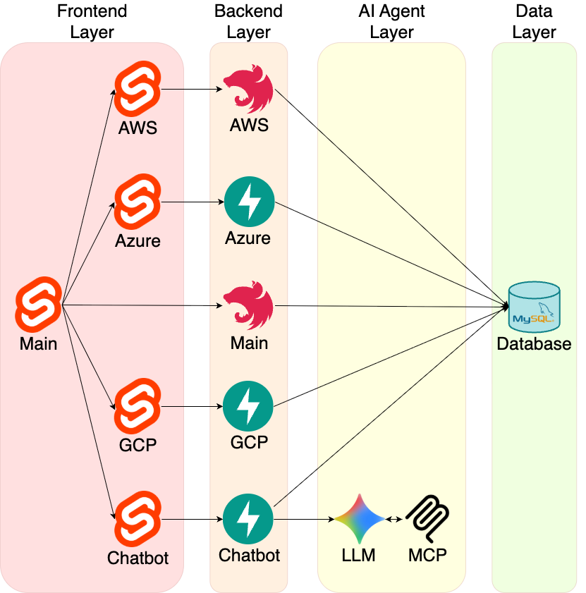
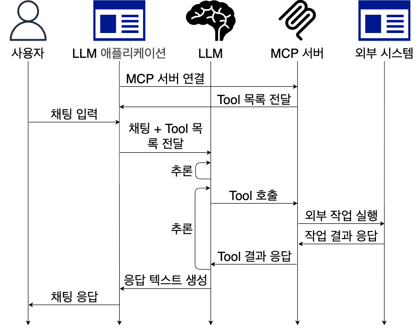

# NLP Cloud Manager

## Overview

---


## 1. Frontend

### Base
```bash
cd frontend
pnpm install
pnpm run dev
```

### AWS
```bash
cd frontend/services/aws
pnpm install
pnpm run dev
```

### Azure
```bash
cd frontend/services/azure
pnpm install
pnpm run dev
```

### GCP
```bash
cd frontend/services/gcp
pnpm install
pnpm run dev
```

## 2. Backend 

### Base
```bash
cd backend/base
pnpm install
pnpm run start:dev
```

### AWS
```bash
cd backend/aws
pnpm install
pnpm run start:dev
```

### Azure
```bash
cd backend/azure
uv run main.py
```

### GCP
```bash
cd backend/gcp
uv run main.py
```

## 3. Chatbot Server
```bash
cd backend/chatbot
uv run main.py
```

## 4. Terraform

```bash
cd terraform
terraform init
terraform apply
```

```bash
kubectl -n istio-ingress port-forward svc/istio-ingressgateway 8080:80
curl -H "Host: nlp-cloud-manager.local" http://localhost:8080/
```